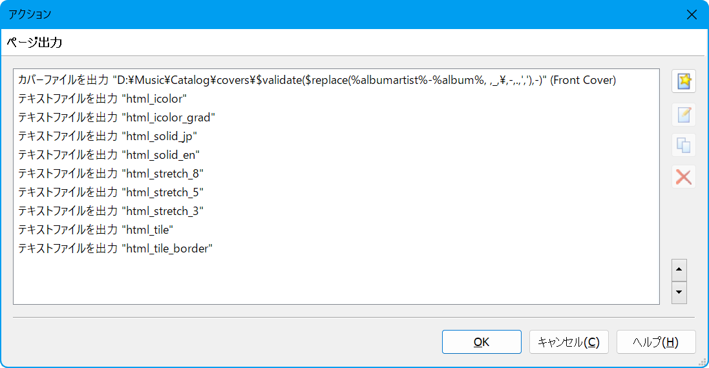

# Mp3tag HTML テンプレート集

オーディオタグエディタ、[Mp3tag](https://www.mp3tag.de/) のテキストファイル出力機能で使う HTML テンプレート集

アルバムアート書き出し機能と合わせると画像の表示が可能

## インストール

### Standard Installation 環境

インストールスクリプトを使う場合は `install.bat` を実行してください（送り先にある同名のファイルは上書きされます）。
手動でインストールする場合は `%APPDATA%\Mp3tag\export\` に MTE ファイルを配置してください。

### Portable Installation 環境

`{Mp3tag フォルダ}\export\`に MTE ファイルを配置してください。

## アンインストール

### Standard Installation 環境

`uninstall.bat`を実行すると該当ファイルが削除されます（たまたま削除リストと同名のファイルがあった場合でも削除されます）。
手動でアンインストールする場合は `%APPDATA%\Mp3tag\export\` に配置済みの MTE ファイルを削除してください。

### Portable Installation 環境

`{Mp3tag フォルダ}\export\`に配置済みの MTE ファイルを削除してください。

## アクションの設定方法

`アクション -> アクション -> 新規作成` からアクションをつくって、「テキストファイルを出力」をアクションに加える

アルバムアートを使うテンプレートの場合は「カバーファイルを出力」も設定する

### HTML の書き出し

テンプレートファイルを選んで出力先を指定する

「上書きでなく追記にする」は無効にする

### アルバムアートの書き出し

「カバーファイルを出力」のアクションを設定する

ファイル名規則は `{テキストファイルを出力したフォルダ}\Covers\$replace($validate(%albumartist%-%album%,-), ,_)` とする

出力フォルダが同じなら、テキストファイルを複数出力した場合でもこのアクションは１回の実行で十分

「テキストファイルを出力」アクションとの実行順は問わない

## ライセンス

[The Unlicense](LICENSE)
